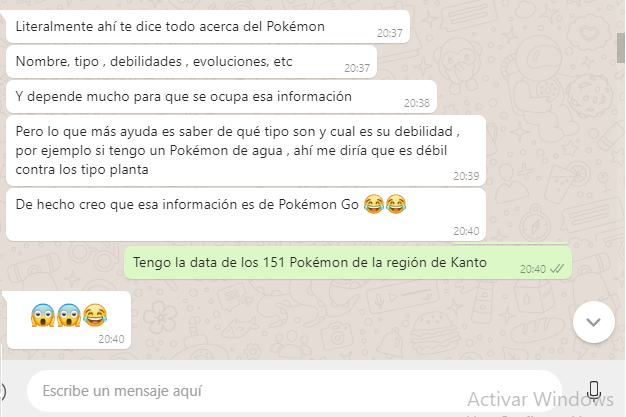
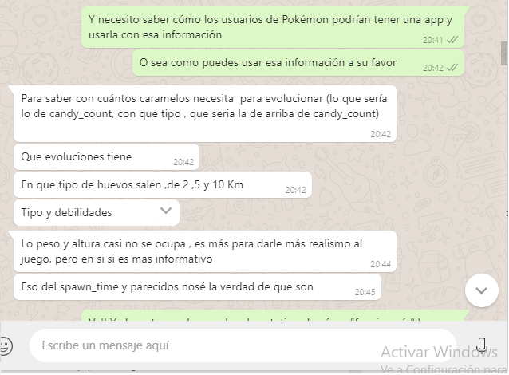

# Data Lovers

## Índice

- [Preámbulo](#preámbulo)
- [Descripción](#resumen-del-proyecto)
- [Definición del producto](#definición-del-producto)
- [Contenido de referencia](#contenido-de-referencia)
- [Checklist](#checklist)

---

## Preámbulo

Pokémon es una franquicia que originalmente comenzó como un videojuego RPG, pero debido a su popularidad ha logrado expandirse a otros medios de entretenimiento como series de televisión, juegos de cartas, ropa, entre otros, convirtiéndose en una marca que es reconocida en el mercado mundial. Al convertirse en una franquicia muy conocida, ha dejado su huella en la cultura popular. Los personajes de Pokémon se han convertido en iconos en la sociedad. Como por ejemplo, se han visto 2 globos gigantes de Pikachu en el Desfile del Día de Acción de gracias de Macy's, que se realiza en la ciudad de Nueva York.

En verano de 2016, la aplicación para dispositivos móviles, Pokémon GO salió al mercado y revivió el "boom" que la franquicia vivió al inicio del 2000 cuando el videojuego y el anime de este llegaron a todo el mundo. Pokémon GO inició un fenómeno que se volvió viral en las redes y generó un gran aumento en las acciones en bolsa de Game Freak, Niantic y Nintendo.69 El éxito de la aplicación realzó el nombre de la franquicia y ayudó más tarde al éxito mundial en ventas de los videojuegos para la consola Nintendo 3DS.

## Resumen del proyecto

En este proyecto **se construyó una _página web_ para visualizar un
_conjunto (set) de datos_** que se adecúo a lo que descubrimos que nuestro usuario
necesitaba.

Una vez que definimos nuestra área de interés, entiendimos quién es nuestro usuario y qué necesitabamos saber o ver exactamente, posteriormente construimos la interfaz que le ayudó a interactuar y entender mejor esos datos.
Como entregable final tenemos una página web que permite **visualizar la data,
filtrarla, ordenarla y hacer algún cálculo agregado**.

## Definición del producto
### Contextualización del Proyecto
Pokémon GO es un videojuego de realidad aumentada basado en la localización desarrollado por Niantic, Inc. para dispositivos iOS y Android. Es un videojuego gratuito pero contiene microtransacciones. El juego consiste en buscar y capturar personajes de la saga Pokémon escondidos en ubicaciones del mundo real y luchar con ellos, lo que implica desplazarse físicamente por las calles de la ciudad para progresar. La aplicación comporta un elemento de interacción social, ya que promueve reuniones físicas de los usuarios en distintas ubicaciones de sus poblaciones.

El videojuego requiere que el jugador recorra las calles de su ciudad para descubrir toda clase de Pokémon, cuyas distintas especies aparecen dependiendo de la zona visitada. Las calles del mundo real aparecen representadas en Pokémon GO en forma de mapa, que muestra el lugar donde se encuentra el jugador. Utiliza la realidad aumentada y de acuerdo con el concepto original, los entrenadores podrán capturar Pokémons hasta completar una colección. Y es aquí donde nuestra aplicación da un plus al videojuego.

La librería Pokémon es una aplicación que ayuda al usuario a visualizar de una manera más accesible y dinámica el contenido del videojuego POKÉMON GO. Muestra los 151 pokémons con sus características, debilidades y tiempos específicos de aparición. ¿Qué la hace diferente a lo que ya muestra  el videojuego? La  diferencia radica en que nuestra librería visualiza desde un inicio cada uno de los pokémons sin importar si el usuario los ha atrapado o no. Situación que el videojuego no maneja; además tiene opciones más especificas de búsqueda que ayudan al usuario a filtrar los 151 pokémons por tipo, por orden y por tiempo de aparición

### Historias de usuario
1.- Como USUARIO quiero tener una pantalla de incio que sea acorde a la temática de POKEMON.

    -Criterios de Aceptación:

    PANTALLA DE INICIO: En caso de que el usuario al ingresar a nuestra página necesite una pantalla de incio, mostrarlo elementos relacionados a Pokemon, teniendo un fondo y colores alucives al mismo, cuando el juego de PokemonGo no le de esa ttemática la aplicación será clara y minimalista para que sea agradable al ojo de nuestro usuario.

2.- Como USUARIO quiero poder ver los 151 pokemon de la región de Kanto de manera clara y amigable.

    -Criterios de Aceptación:
    MOSTRAR TODOS LOS POKEMON: En caso de que el usuario quiera ver todos lo pokemones en una sola pantalla, cuando el videojuego de PokemonGo no le esta dando esta alternativa si el mismo no ha capturado el pokemon, nuestra aplicación debe mostrarle la información que necesite aún cuando el usuario no tenga capturado ese pokemon.

3.-Como USUARIO quiero poder FILTRAR a los pokemon por su tipo, para poder solo observar los que me interesan de una manera más concisa.

    -Criterios de Aceptaión: 
    FILTAR POR TIPO: En caso de que el usuario al usar nuestra aplicación decida filtar los pokemon por su tipo, cual el videojuego de PokemonGo no le de esa alternativa; nuestra aplicación le permitirá filtrar la información cuantas veces quiera, mostrandole así la información que buesca a través de sencillos e intuitivos pasos.

4.- Como USUARIO quiero tener acceso a los 151 pokémons ordenados de manera ascendente o descendente para poder acceder a ellos de una manera más eficiente.

    - Criterios de Aceptación:

	ORDENAR DE MANERA ASCENDENTE. En caso que el usuario al usar nuestra
    aplicación haga una búsqueda de una manera más especifica y adicionalmente 	lo haga	de manera ascendente, cuando el videojuego PokemonGo no le de esta alternativa, nuestra aplicación debe llevarlo de manera clara al resultado que busca a través de sencillos e intuitivos pasos para lograrlo.

5.-Como USUARIO quiero saber que tiempo de espera aproximada se tiene al atrapar a cada uno de los Pokémon para poder hacer mas ágil la búsqueda de los mismo por la ciudad.

    -Criterios de Aceptación:

    TIEMPO DE APARICIÓN. En caso que el usuario este en búsqueda de un  determinado Pokémon y vaya a la ubicación predeterminada y adicionalmente que el Pokémon en cuestión no se encuentre en ese momento, cuando  el videojuego no especifique de una manera mas puntual el tiempo a esperar, nuestra aplicación debe solventar esa información para que el usuario decida si esperar o regresar al lugar de una forma más inteligente y sencilla.

6.-Como USUARIO quiero que la aplicación tenga una funcionalidad e interfaz agradable para poder acceder de manera intuitiva y rápida al contenido que buscó en determinado momento.

	-Criterios de Aceptación:

	FUNCIONALIDAD E INTERFAZ. En caso que el usuario busque una aplicación agradable e intuitiva y adicionalmente tenga la información que busca de 	manera eficaz, cuando el videojuego Pokémon Go no le otorgue esta accesibilidad, nuestra aplicación debe cubrir en su totalidad las necesidades
    que nuestro usuario tiene para hacer de su experiencia con el mundo Pokémon
    única. 

### Diseño de la Interfaz de Usuario

Nuestra aplicación tiene como punto focal la asociación que se tiene con la franquicia de Pokémon y en particular con el videojuego Pokémon Go, por tanto las imágenes y colores usados en ella tienen completa alusión con la franquicia. Es así que la repetición de elementos tanto en página de inicio como en los diferentes cambios de pantalla son generados de manera intencional para dar al usuario una completa inmersión dentro del Mundo Pokémon, haciendo de su experiencia algo único y agradable.

#### Prototipo de baja fidelidad

#### Prototipo de alta fidelidad
Dentro del proyecto realizamos las dos visualizaciones requeridas: [Mobile](https://marvelapp.com/41j5h2a/screen/52876710) y [Desktop](https://marvelapp.com/5824bca/screen/52881194).

#### Testeos de usabilidad

Para los testeos de usabilidad:
1. Le mostramos la data a los usuarios para que observaran que elementos le eran útil y cuál veían inecesaria a lo que obtuvimos lo siguiente:

Con base a esa información fue que se fue manejando la Base de Datos a corde a lo que el usuario nos menciono y la información mostrada fue la que el usuario solicito y menciono que le funcionaba.

## Contenido de referencia

### Diseño de experiencia de usuario (User Experience Design)

- Investigación con usuarios / entrevistas

    Una vez que ya teniamos el prototipo de alta fidelidad fue testeado; a lo que el usuario hizo las siguientes observaciones para ambos prototipos de alta fidelidad:

    #### Versión Mobile
        1. El carrusel que esta en la pantalla de inicio para la verisón mobile no es tan intuitivo, debe hacerse más accesible.
        2. La ficha técnica del pokemon es la que lo muestra como un perfil de la red social Facebook con la misma temática que tiene POKEMON GO, que contiene un fondo acorde al tipo que es el pokemon y debajo su información.
        3. Los colores que se usaron en el prototipo no son los adecuados por lo que hubo que modificarlos.

    #### Versión Desktop
        Esta versión fue la que más le agrado al usuario y en la que se baso el proyecto, de tal forma que esta 90% apegado a este prototipo; ya que se modifico la imagen que hay de fondo en el incio y el fondo del contenido con una temática más apegada a Pokemon y a la región de Kanto.
    
    Una vez hecho es testeo de los prototipos de alta fidelida se paso a testear la app ya con las funcionalidades sugeridas por el usuario. Se testeo con usuario de diferentes edades y los resultados los podras encontrar en la siguiente liga:

    [Testo de la página](https://1drv.ms/p/s!AmkkKLbuChrBgp9-JgMOcXCDqpA-eg)

- Principios de diseño visual

### Desarrollo Front-end

- Unidad de testing en curso de JavaScript en LMS.
- Unidad de arreglos en curso de JavaScript en LMS.
- Unidad de objetos en curso de JavaScript en LMS.
- Unidad de funciones en curso de JavaScript en LMS.
- Unidad de DOM en curso de Browser JavaScript en LMS.
- [Array en MDN](https://developer.mozilla.org/es/docs/Web/JavaScript/Referencia/Objetos_globales/Array)
- [Array.sort en MDN](https://developer.mozilla.org/es/docs/Web/JavaScript/Referencia/Objetos_globales/Array/sort)
- [Array.map en MDN](https://developer.mozilla.org/es/docs/Web/JavaScript/Referencia/Objetos_globales/Array/map)
- [Array.filter en MDN](https://developer.mozilla.org/es/docs/Web/JavaScript/Referencia/Objetos_globales/Array/filter)
- [Array.reduce en MDN](https://developer.mozilla.org/es/docs/Web/JavaScript/Referencia/Objetos_globales/Array/reduce)
- [Array.forEach en MDN](https://developer.mozilla.org/es/docs/Web/JavaScript/Referencia/Objetos_globales/Array/forEach)
- [Object.keys en MDN](https://developer.mozilla.org/es/docs/Web/JavaScript/Referencia/Objetos_globales/Object/keys)
- [Object.entries en MDN](https://developer.mozilla.org/es/docs/Web/JavaScript/Referencia/Objetos_globales/Object/entries)
- [Fetch API en MDN](https://developer.mozilla.org/en-US/docs/Web/API/Fetch_API)
- [json.org](https://json.org/json-es.html)

### Herramientas

- [Git](https://git-scm.com/)
- [GitHub](https://github.com/)
- [GitHub Pages](https://pages.github.com/)
- [Node.js](https://nodejs.org/)
- [Jest](https://jestjs.io/)
- [Boostrap](https://getbootstrap.com/docs/4.0/getting-started/download/)

---

## Checklist

- [x] Usa VanillaJS.
- [x] No hace uso de `this`.
- [x] Pasa linter (`npm pretest`)
- [x] Pasa tests (`npm test`)
- [x] Pruebas unitarias cubren un mínimo del 70% de statements, functions y
      lines y branches.
- [x] Incluye _Definición del producto_ clara e informativa en `README.md`.
- [x] Incluye historias de usuario en `README.md`.
- [x] Incluye _sketch_ de la solución (prototipo de baja fidelidad) en
      `README.md`.
- [x] Incluye _Diseño de la Interfaz de Usuario_ (prototipo de alta fidelidad)
      en `README.md`.
- [x] Incluye el listado de problemas que detectaste a través de tests de
      usabilidad en el `README.md`.
- [x] UI: Muestra lista y/o tabla con datos y/o indicadores.
- [x] UI: Permite ordenar data por uno o más campos (asc y desc).
- [x] UI: Permite filtrar data en base a una condición.

## Checklist (Opcional)

- [ ] Consume data de forma dinámica (`fetch()`).
- [ ] Utiliza Librerías de graficas (`chart.js` ó `google chart`).
- [ ] Cobertura de coverage al 100%.
