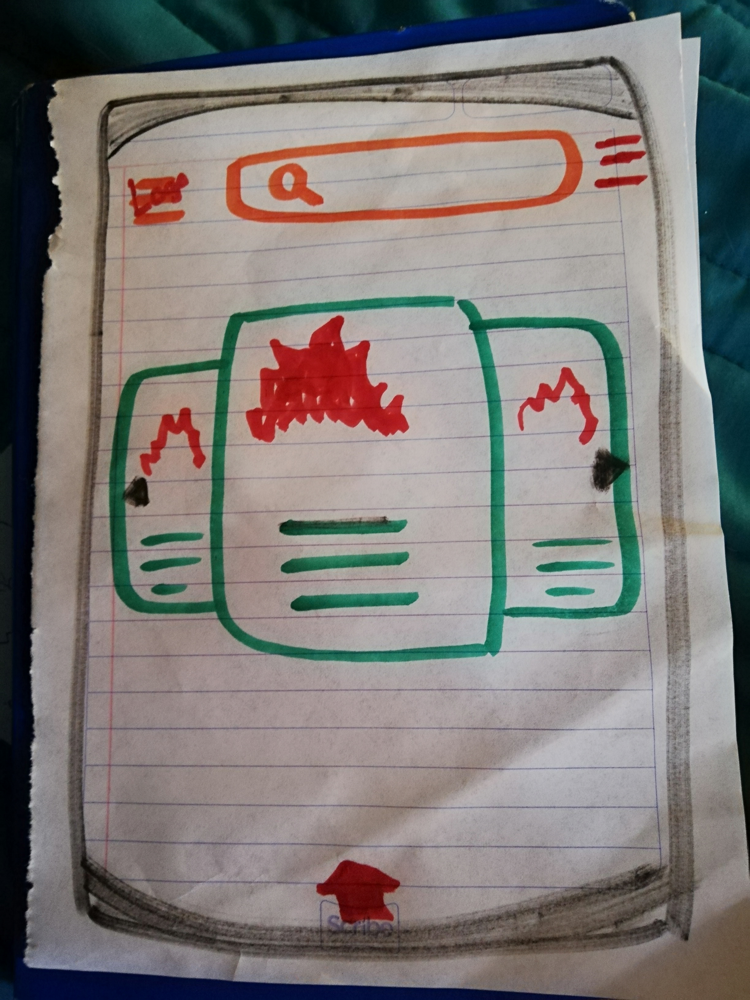
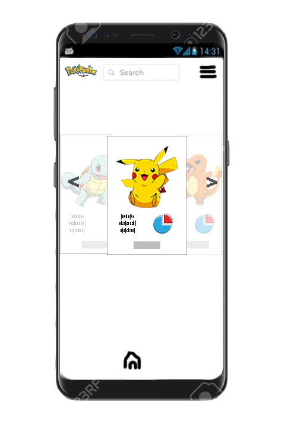
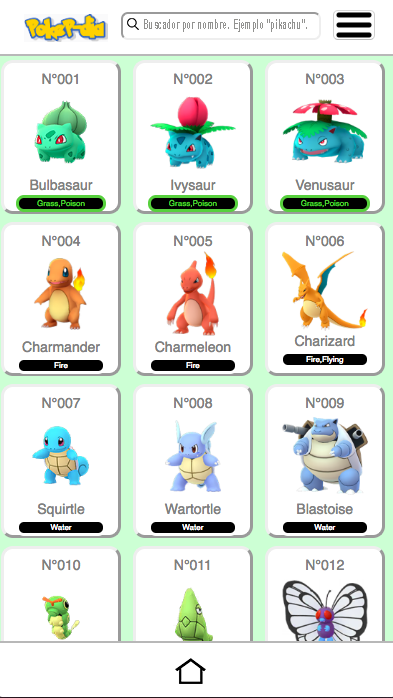
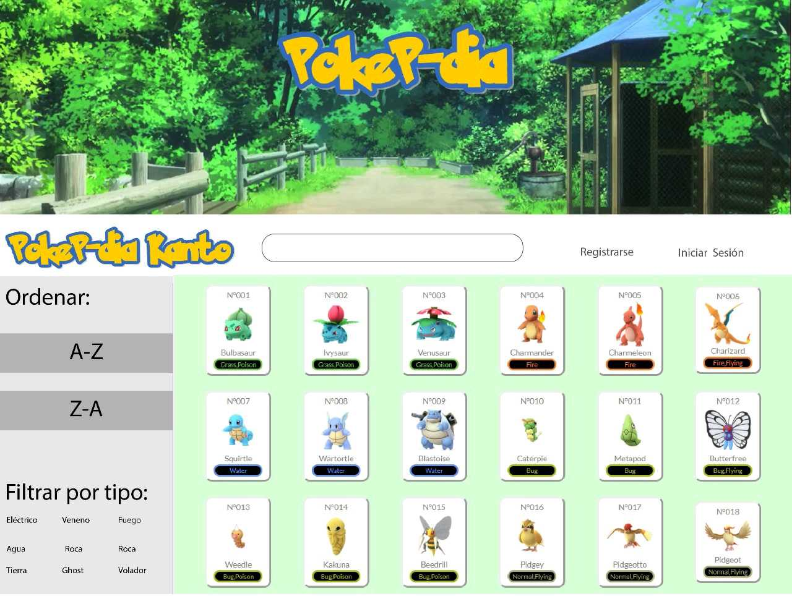

# POKE-PDIA

## Preámbulo

La historia de **Pokémon** se remonta a dos décadas en el pasado, si sólo contamos desde el momento en que los primeros juegos fueron desarrollados. Pero si lo vemos como concepto, el juego tiene más tiempo en la mente de su creador, **Satoshi Tajiri**.

Cuando él era un niño, le gustaba atrapar insectos y renacuajos. Por supuesto, esto le dio la idea de capturar a unas criaturas y tenerlas en una colección. De igual manera, quería que todos los demás pudieran sentir lo que él sentía al coleccionar estos bichos. Fue así que la idea de lo que conocemos hoy como **Pokémon** inició.

**Pokémon** se ha convertido en la más exitosa franquicia dentro del entretenimiento superando a títulos como Star Wars, Harry Potter o Mario Bros.

Con más de **300 millones** de copias vendidas alrededor del mundo, Comic Book nombró a Pokémon como la marca más rentable del ocio al obtener 59 billones de dólares de ganancias desde su creación. Esta impresionante cifra llega de mano de sus videojuegos (tanto de móviles y de consolas) como de su experiencia en películas y series, más no de juguetes y productos relacionados.

## GENERACIÓN 1 – KANTO – 27 DE FEBRERO DE 1996.

Los primeros juegos fueron Pokémon Red y Pokémon Green en GameBoy para Japón. En América fue la versión roja y azul en 1999. El sueño de Satoshi Tajiri había sido cumplido, los demás podían experimentar su pasión por los bichos, permitiéndoles atrapar hasta 151 Pokémon en los juegos.

Inicialmente los juegos de Pokémon tuvieron ventas modestas pero, justo después de que se descubriera a Mew, la revista CoroCoro anunció un evento para regalarlo, por lo que las ventas se dispararon.

Los juegos de esta generación son las versiones roja, azul, y verde, así como la versión amarilla que tenía a Pikachu como inicial.

Y aquí está, la que lo empezó todo, la que nos hizo pensar que recorrer el mundo coleccionando bichos y sacándolos a pelear en combates por turnos era lo mejor de lo mejor. El recuerdo nostálgico de las aventuras por la región de Kanto es algo que difícil se borrará de la memoria colectiva. Evidentemente, se trata de las entregas más importantes porque fueron las que lo iniciaron todo, las que dieron pie a un estilo de juego muy propio (coleccionar bichos). Y es por eso que esta primera generación se encuentra en el top 5 de las favoritas para los seguidores de esta saga.

### Resumen del proyecto

**POKE-PDIA** es una platafora web que está inspirada en la primera generación de **POKEMON**. Es una plataforma que te muestra de manera dinámica la infomación de los 151 personajes de la región de Kanto.

El objetivo de la plataforma es que los usuarios la utilizen como biblioteca virtual de esta serie de POKEMON, compartan a sus personajes favoritos y conozcan datos interesantes y poco conocidos.

### Definición del producto

Mediante varias encuestas que realizamos a usuarios interesados en la trayectoria de POKEMON, nos dimos cuenta que la data mostrada, se encontraba en la aplicación POKEMON GO (de hecho la data está extraída de esta última aplicación). Por lo que decidimos con base a toda la retroalimentación recibida, crear una "biblioteca virtual" para que los usuarios accedieran a los 151 pokemon de la región Kanto (primera generación).

## Proto persona

### Historias de usuario

1. A mi como usuario me gustaría visualizar a todos los Pokemones en la primera pantalla.
2. A mi como usuario me gustaría tener filtros para ordenar a los pokemones dependiendo del tipo.
3. A mi como usuario me gustaría que la plataforma me permita ordenar los pokemones en orden alfabético, de la A-Z y de la Z-A.
4. A mi como usuario me gustaría que la interfaz tenga un diseño simple y de fácil manejo
5. A mi como usuario me gustaría que todas la funciones de la interfaz están respaldadas por pruebas unitarias.

### Entrevistas a usuarios

1. Armando Navarro (28 años).
El usuario comenta (y con base en la información que se le presenta) que le gustaría tener una aplicación que fuera un “biblioteca” de la primera generación de pokémon (Kanto). Le gustaría que esta aplicación mostrara data relevante de pokémon (características, estas se incluyen en la data proporcionada), también le gustaría que se mostrarán datos curioso sobre esta caricatura (primera y segunda temporada).
En cuanto al filtro, sugiere que se mediante type, nombre…

2. Crhistian Jhonathan (28 años)
Como usuario necesita una app que le ayude a encontrar los ataques efectivos para los pokemones de la aplicación Pokemon Go.
Necesita además poder encontrar el pokémon por nombre o si no recuerda el nombre por tipo.
Quiere una pantalla interactiva donde le permita usar el filtro de manera facil y comoda, ya que ha intentado con otras aplicaciones que ofrecen lo mismo pero son difíciles de entender.
Quisiera además que le mostrara las evoluciones de un mismo pokémon en la misma pantalla y con darle clic a una evolución aparezca la información de ese nuevo Pokemon .
Sin duda Crhistian busca una app completa y con una interfaz amigable para que la búsqueda sea fácil.

### Diseño de la Interfaz de Usuario

#### Prototipo de baja fidelidad

#### Prototipo de alta fidelidad

#### Testeos de usabilidad

1. Jhonathan Parra:
- Las letras de las tarjetas y las tarjetas mismas son pequeñas, le es difícil la lectura de las mismas.
- En las tarjetas le gustaría primero visualizar el nombre del pokemon.
- Considera que las tarjetas requieren un diseño más llamativo.
- Los botones de "Ordenar", son poco visibles, requieren más diseño.

2. Sergio Guadarrama:

**Versión Web**

- Tipografía POKEP-DIA, hacer contraste entre fondo y letra
- Poner alguna leyenda o indicio de qué se trata la plataforma para que el usuario se familiarice y entienda rápidamente el concepto (texto o slogan). Ejemplo “Biblioteca Virtual: Primera Generación, Kanto”
- Imagen / contraste tratar de buscar referencias de imagen header en web. Investigar “fondo - contraste”
- Input / Buscador. Poner icono de lupa y una leyenda dentro del buscador que diga “Buscador sólo por nombre. Ejemplo “pikachu”.”

- Modales. Agrandar los títulos:

Separar las debilidades. Buscar referencias gráficas para cambiar apariencia de botón, conservando la línea de diseño de la interfaz. Revisar la posibilidad de cuando abre el modal, poder dar click en cualquier parte de la página y que este se cierre.

- Sección “filtrado por tipo”. Generar contorno de botones y poner debajo con letra el tipo”.

- Sección “Ordenar Pokemon”. Espacio entre los botones. Y revisar cómo se va a visualizar los párrafos. Buscar “Tipos de lectura de usuarios hacia la página”

**Versión Mobile**

- En el input “buscador”, repetir las mismas instrucciones que en web.
- Poner el logo de POKEP-DIA  con el slogan o texto.
- Modificar detalles del menu desplegable.
- Footer. Colocar casita para regresar a inicio. Primero investiga “10 principios de usabilidad, Jako Nielsen”. Para este punto es importante poner especial atención al principio #10. Con base en este ultimo punto, también definir si es importante que existe otro botón.

**Visualización “Promedio”**

Para esta última sección es importante reacomodarla. Se sugiere que en cuanto cargue el navegador, la primera pantalla que se muestre, arroje está cifra y tengo un texto cómo “¿Sabías qué?”.

## Iteración de usabilidad

Para esta primera iteración de experiencia al usuario de la plataforma, se realizaron seis entrevistas. Para escuchar las entrevistas da click [aquí](https://soundcloud.com/egenesis-egonzalez).

Con base a las anteriores pruebas de usabilidad se llegó a los siguientes insights:

Partiendo de estos puntos, se sugiere realizar los siguientes cambios en la interfaz:

1. Escuchando el día a día de los usuarios, se llegó a la conclusión de que la interacción para la plataforma es mediante dispositivos móviles, por lo que se sugiere mejorar el rendimiento de esta parte de la interfaz.
2. Mejorar la imagen de la interfaz. Los usuarios no tienen del todo claro que se trata de una biblioteca virtual de **la primera generación de Pokemon**. Por tanto se incluyó una pantalla de inicio con el logo de Pokep-dia.
3. A pesar de que el modo de juego es online y mediante celular, los usuarios buscan algún tipo de interacción con otros jugadores. Se sugiere agregar botones de compartir y alguna sección donde se comparta los lugares de reunión para cazar Pokemon.
4. Las pruebas de usabilidad arrojaron que para los usuarios fue difícil encontrar los botones para acomodar por orden ascendente, descendente y el botón de "Sabías qué". En este punto se sugiere reacomodar el orden de las secciones de botones.

Con estos puntos, se realizó la siguiente iteración en la interfaz:

## Pre-requisitos e instalación

1. Antes que nada, asegúrate de tener un editor de texto en
   condiciones, algo como [Atom](https://atom.io/),
   [Visual Code](https://code.visualstudio.com/), [Sublime Text](https://www.sublimetext.com) o cualquier otro de tu preferencia.
2. Para ejecutar los comandos a continuación necesitarás una
   [UNIX Shell](https://github.com/Laboratoria/curricula-js/tree/v2.x/topics/shell),
   que es un programita que interpreta líneas de comando (command-line
   interpreter) así como tener [git](https://github.com/Laboratoria/curricula-js/tree/v2.x/topics/scm/01-git)
   instalado. Si usas un sistema operativo "UNIX-like", como GNU/Linux o MacOS,
   ya tienes una _shell_ (terminal) instalada por defecto (y probablemente `git`
   también). Si usas Windows puedes usar [Git bash](https://git-scm.com/download/win),
   aunque recomendaría que consideres probar GNU/Linux como tu Sistema Operativo.
3. Haz tu propio [fork](https://help.github.com/articles/fork-a-repo/)
   de [ este repositorio](https://github.com/GENESIS-ENRIQUEZ/cdmx-2019-01-bc-core-data-lovers)
4. [Clona](https://help.github.com/articles/cloning-a-repository/)
   tu _fork_ a tu computadora (copia local).
5. Instala las dependencias del proyecto con el comando `npm
   install`. Esto asume que has instalado [Node.js](https://nodejs.org/) (que
   incluye [npm](https://docs.npmjs.com/)).
6. Si todo ha ido bien, deberías poder ejecutar las :traffic_light:
   pruebas unitarias (unit tests) con el comando `npm run test`.

## Consideraciones técnicas

Este proyecto está desarrollado con:
- EMS6 JavaScript puro [JSVanilla](https://medium.com/laboratoria-developers/vanillajs-vs-jquery-31e623bbd46e).
-CSS3
-HTML5
- Se realizaron pruebas unitarias para validar la funcionalidad de codificación y decodificación. Estos test se implementaron con [JEST](https://jestjs.io/),
- Como gestor de proyecto se utilizó NPM (Node Package Manager) (https://www.npmjs.com/).

## Pruebas

Las pruebas unitarias para este sistema requieren de una instalación simple a través del comando npm install. Los tests verifican que las funciones relacionadas a la manipulación de la data funcionen de manera óptima.

Funciones relacionadas con el filtrado, ordenamiento alfabético y operaciones relaciones al promedio de la data, están testeadas y las puedes encontrar en el la carpeta de test.

## Autores
- Ameyalli Brito González
- Génesis Enriquez González
