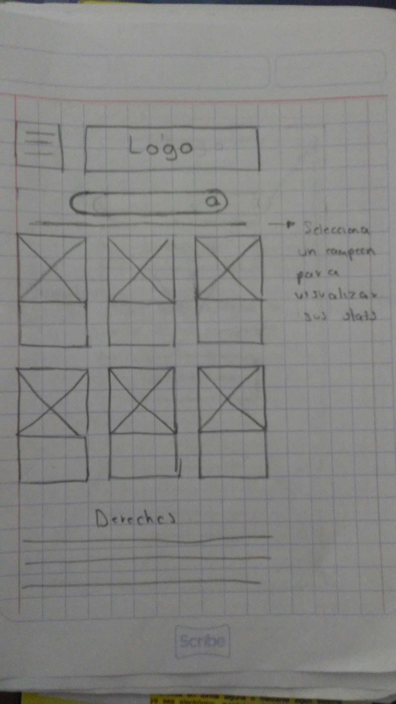
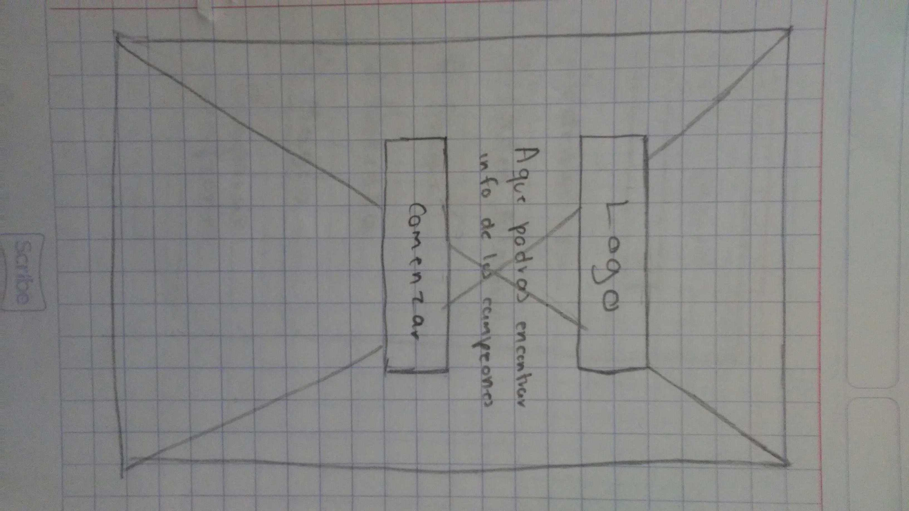
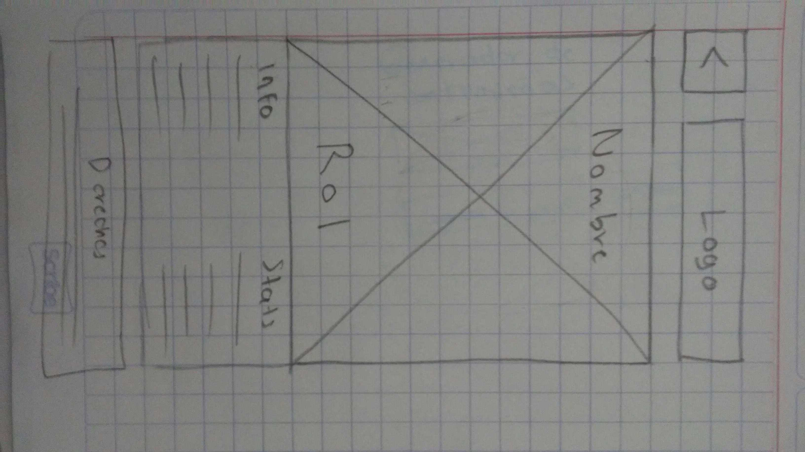
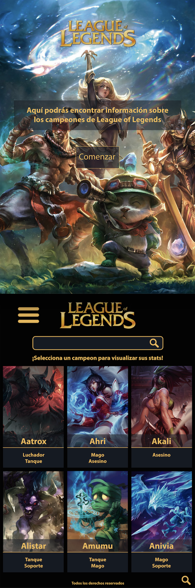
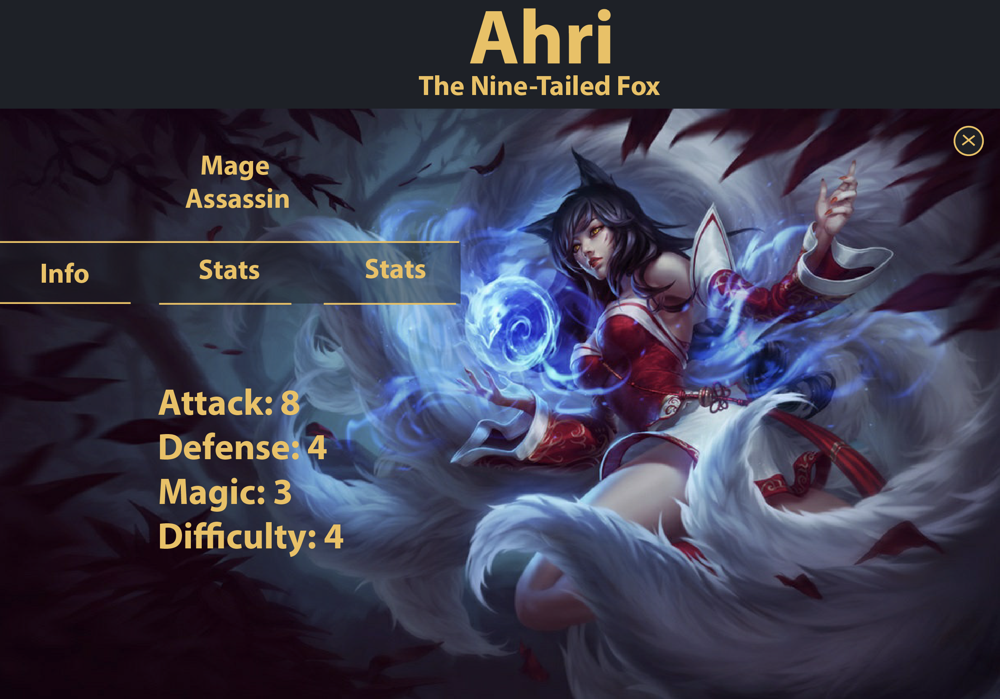
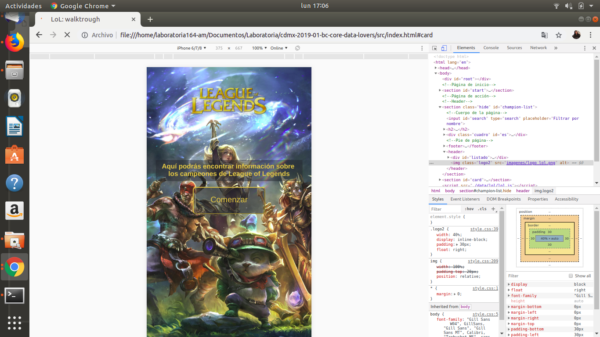
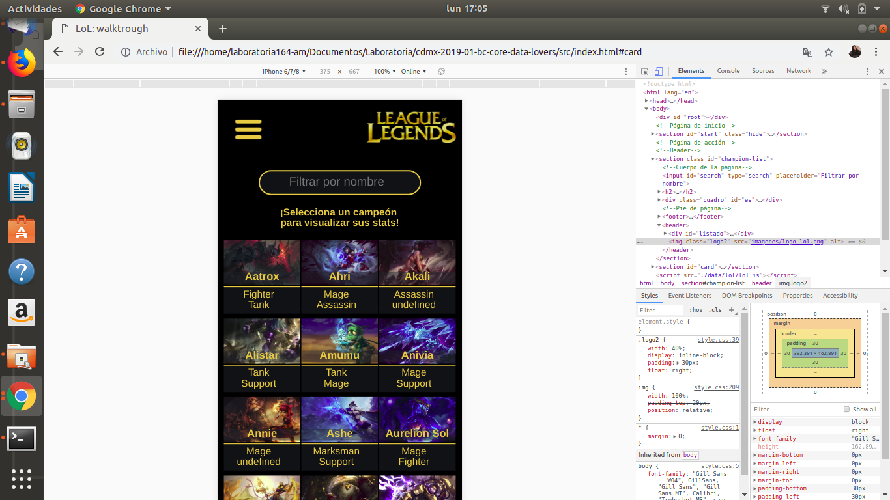
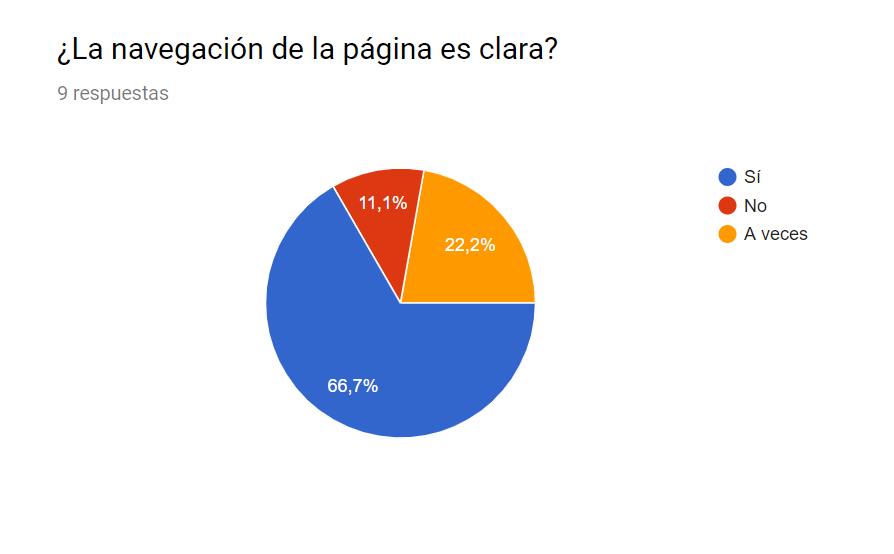
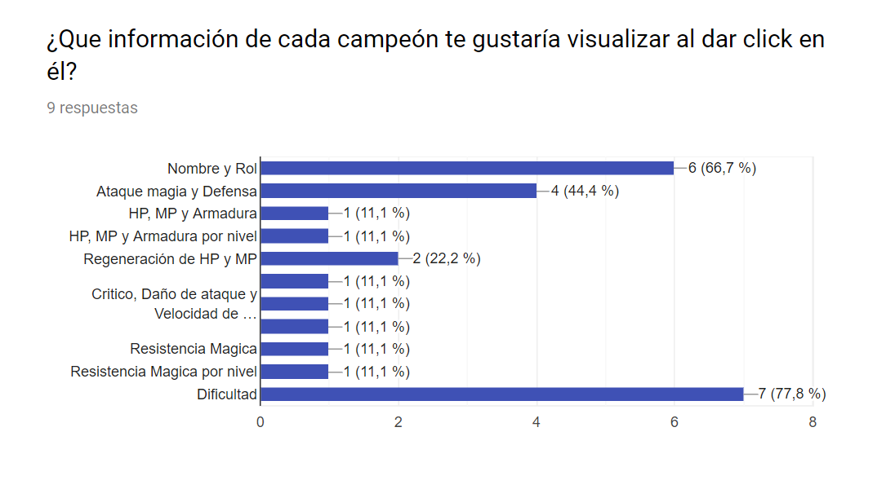
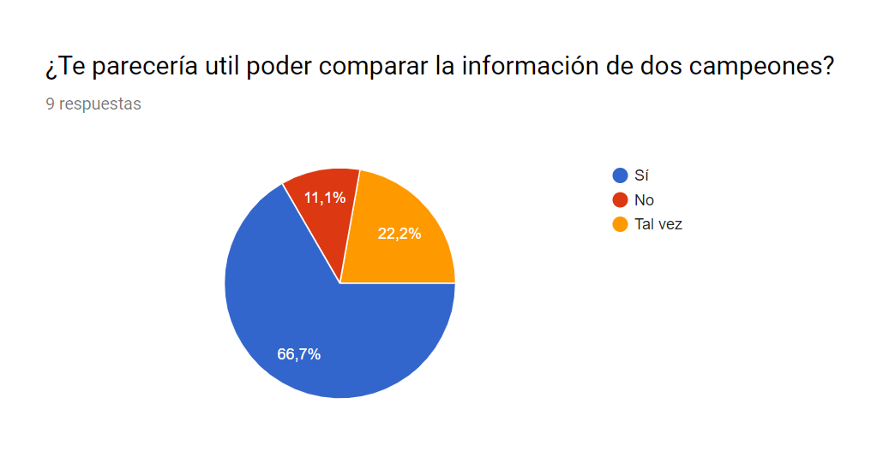

## LoL: Walkthrough

## Descarga, instalación y ejecución de producto
Es una aplicación responsiva, mobile first, se accede por medio del link: 
https://elenore29.github.io/cdmx-2019-01-bc-core-data-lovers/src/index.html

### Herramientas usadas
La aplicación está estructurada utilizando:
 - Un editor de texto (Visual Code) 
 - Vanilla JS
 - HTML 5
 - CSS
 - GitHub 
 - GitHub Pages 
 - Git Bash 
 - Node.js
 - Jest
 - Photoshop

### Scripts / Archivos
- README.md: explica cómo descargar, instalar y ejecutar la aplicación así como una introducción a la aplicación, su funcionalidad y decisiones de diseño tomadas.
- data.js: contiene las funciones que manipulan la data (procesar, filtrar y ordenar).
Se invoca al bucle for...in para procesar la data de objetos y convertirlo en un nuevo arreglo para mostrar cierto fragmento de información (siete indicadores), así como  las funciones .filter() y .sort() a través de los eventos generados al dar click en los botones y la lista desplegable de la aplicación.
Funciones implementadas:
* `filterData(data, condition)`: esta función `filter` o filtrar recibiría la
  data, y nos retornaría aquellos datos que sí cumplan con la condición.
* `sortData(data, sortBy, sortOrder)`: esta función `sort` u ordenar recibe tres parámetros.
  * El primer parámetro, `data`, nos entrega los datos.
  * El segundo parámetro, `sortBy`, nos dice con respecto a cuál de los campos de la data se quiere ordenar.
  * El tercer parámetro, `sortOrder`, indica si se quiere ordenar de manera
  ascendente o descendente.
- lol.js: set de datos que muestra la lista de campeones del videojuego League of Legends.
- main.js: es donde se implementan los eventos del DOM para permitir interacción con el usuario al mostrar, filtrar y ordenar la data, el cual debe estar exportado en el objeto global (window).
- html/index: tiene la estructura de la página.
- data.spec.js: se encuentran los tests para confirmar que window.lol es un objeto y que las funciones de .filter() y .sort() son funciones.
- CSS: permite dar el diseño a la interfaz en elementos como la tipografía, color, imagen de fondo, acomodar los elementos como textos, imágenes, botones, lista desplegable, encabezado, contenido y pie de página.
- Carpeta de imágenes: se agregó una carpeta extra a la data ya brindada, esto con el fin de utilizar las imágenes para el fondo de pantalla en la página de inicio, un logo para página de inicio y otro para el encabezado, la lupa para el input de búsqueda y la imagen para el ícono de la página.
 - Carpeta de prototipos: se encuentran los bocetos de baja y alta calidad.
 - Carpeta de evidencia: muestra los resultados de la encuesta realizada.

## Ejecución de pruebas
El boilerplate contiene la configuración necesaria para ejecutar los tests, en este caso las pruebas unitarias.
Se ejecutan eslint y htmlhint para verificar el HTML y JavaScript con respecto a una guías de estilos. Ambas tareas se ejecutan automáticamente antes de ejecutar las pruebas cuando se escribe el comando npm run test. 
Finalmente, está el code coverage para ver el nivel de cobertura de los tests también utilizando el comando npm run test.

## Definición del producto
**LoL: Walkthrough** es una app diseñada para jugadores principiantes que están interesados en saber más sobre los personajes del videojuego League of Legends. La app permite visualizar, filtrar y ordenar data (en este caso es información sobre los personajes del videojuego).

League of Legends (conocido por sus siglas LoL) es un videojuego perteneciente al género multiplayer online battle arena (MOBA) y deporte electrónico desarrollado por Riot Games para Microsoft Window y OS X. LoL es un juego de alta competitividad, se encuentra entre los más populares del género, en 2013 se contaron cerca de 5 millones de jugadores conectados al mismo tiempo en todo el mundo.

El juego consta de 3 modos actuales de juego en ejecución: La Grieta del Invocador, El Bosque Retorcido y El Abismo de los Lamentos. Los jugadores compiten en partidas, que duran entre 20 y 60 minutos en promedio. En cada modo de juego, los equipos trabajan juntos para lograr una condición de victoria, normalmente destruyendo la estructura central (llamado Nexo) en la base del equipo enemigo. 

En todos los modos de juego, los jugadores controlan personajes llamados “campeones”, elegidos o asignados en cada partida, que tienen un conjunto de habilidades únicas, con los cuales jugarán toda la partida hasta su conclusión. Desde enero de 2019, hay 143 campeones disponibles. Cabe mencionar que para fines de este proyecto, la data brinda información de 134 campeones.

Los campeones comienzan cada partida con un bajo nivel, y luego ganan experiencia en el transcurso de la partida para alcanzar un nivel máximo de 18. Ganar niveles de experiencia en las partidas permite a los jugadores desbloquear las habilidades especiales de su campeón y aumentarlas de varias maneras únicas para cada personaje.

Debido a la popularidad del juego, la app “LoL: Walkthrough” está diseñada para ayudar a los jugadores novatos, que están adentrándose en el juego, al brindarles información básica como imagen y nombre de cada personaje para reconocerlos fácilmente, así como también los roles y datos estadísticos relevantes (puntos de ataque, magia defensa, dificultad, armadura, etc.). De esta manera, la información servirá para que los usuarios sepan qué jugador adquirir y, al momento de entrar a algun modo de juego, puedan pensar en crear una estrategia de acuerdo al campeón elegido o asignado.

## Historias de usuario
1. Yo como jugador novato, quiero una aplicación que me muestre todos los personajes del juego con sus respectivos nombres para reconocerlos más fácilmente.

2. Yo, como jugador novato, quiero poder filtrar los campeones por rol para poder saber qué campeón pertenece a cada rol.

3. Yo como jugador novato quiero poder visualizar la información de cada campeón en una tarjeta para conocerlos mejor.

**Diseño de experiencia de usuario (User Experience Design):**
**Ideación**
En primera instancia, se buscó seguir el diseño (tipografía y color de League of Legends) para crear una unidad entre el videojuego y la aplicación.
Al momento de maquetar la página, se pensó en aquellas características que no ofrece el juego a los usuarios nuevos. En este sentido, **LoL: Walkthrough** no sólo muestra un listado de los campeones con la imagen y el nombre de cada uno sino también indica el tipo de rol. 

La idea de interacción con el usuario es que al entrar a la página, el usuario de click al botón “comenzar” que lo llevará a un listado de imagen, nombre y roles de los 134 campeones. El usuario tiene la opción de dar click a cada imagen para que se despliegue una tarjeta mostrando más información acerca del campeón seleccionado.

La interacción continúa a través de un cuadro de búsqueda donde el usuario podrá buscar por nombre o al poner una letra, por ejemplo la letra A, la página arrojará como resultado los personajes con la inicial A.

Por otro lado, el usuario podrá dar click y desplegar la lista para filtrar personajes por rol (tanque, peleador, asesino, mago, tirador y soporte); al dar click a cada rol, se mostrarán únicamente los personajes de dicho rol. Asimismo, el usuario también podrá ordenar por número de ataque, magia y defensa de mayor a menor o viceversa. 

## Prototipo de baja fidelidad
Fotos de los bocetos hechos en hoja con lápiz

##Prototipo de alta fidelidad (User Testing)
Imágenes editadas en Photoshop

Avances del primer y segundo sprint

## Pruebas de usabilidad
Uno de los principales problemas que se detectaron fue reconocer que la data brindada está totalmente en inglés y la información de interacción en la página del primer sprint estaba en español. Por tal motivo, se realizó una encuesta a jugadores con el fin de conocer si había algún tipo de inconformidad al ver que la información estuviese en inglés y también para saber si entendían la lógica de la página.

Para el segundo sprint se decidió cambiar el idioma de la información que permite la interacción (texto de bienvenida, de botones, de la lista desplegable y pie de página) teniendo como objetivo mostrar coherencia entre la data utilizada y el producto final entregable. El motivo para sólo dejar la app en inglés también es con la idea de que en un futuro exista la opción para que el usuario pueda elegir más idiomas, pues League of Legends es jugado a nivel mundial y es importante considerar el alcance global.

Otra de las preguntas en la encuesta fue saber qué tipo de información les gustaría conocer de cada campeón, esto ayudó a determinar qué datos se mostrarían -de toda la data- en la tarjeta de cada jugador; como resultado, cada tarjeta mostraría lo más relevante a modo de no saturar de información irrelevante al usuario y mantener el aspecto visual más “limpio”.

## Encuesta

La encuesta realizada se puede ver acá: https://docs.google.com/forms/d/e/1FAIpQLScJVy2w6j63vSefiVoqEpTW78AuqqbGxprD-XtMgdXTLxgsMw/viewform?vc=0&c=0&w=1

Resultados de encuesta

*A futuro se piensa implementar la función de comparar dos campeones

**Problemas de usabilidad detectados a través de los tests**
Más que problemas de usabilidad, se encontraron opiniones que ayudaron a mejorar la forma en que se mostraría la información de cada campeón. Como resultado, la opinión de los encuestados ayudaron a mejorar la propuesta final de la aplicación.

**Implementación de la Interfaz de Usuario (HTML/CSS/JS)**
 - Se muestra la data en una interfaz: una lista con las imágenes que contienen el nombre y los roles de cada personaje, son 134 en total. Al dar click a cada imagen, se despliega una tarjeta que muestra más datos del personaje seleccionado.
 - La aplicación permite al usuario realizar búsqueda por letra, es decir, se puede colocar la inicial y se muestran a los personajes que tengan dicha inicial.
 - La aplicación permite al usuario filtrar la data: puede filtrar por rol (tanque, luchador, asesino, mago, tirador y soporte). 
 - La aplicación permite al usuario ordenar la data: por puntos de ataque, magia y defensa.
 - La información se visualiza sin problemas desde distintos tamaños de pantallas: móviles, tablets y desktops.
 
## Autores
- Elenore Elisa Espinosa Nava 
- Maritza Díaz Robles

## Agradecimientos
 - A las offices hours con Jonh, Mike, Silvana, Dení y Lizzie
 - Al trabajo en dupla
 - A los comentarios de otras duplas
